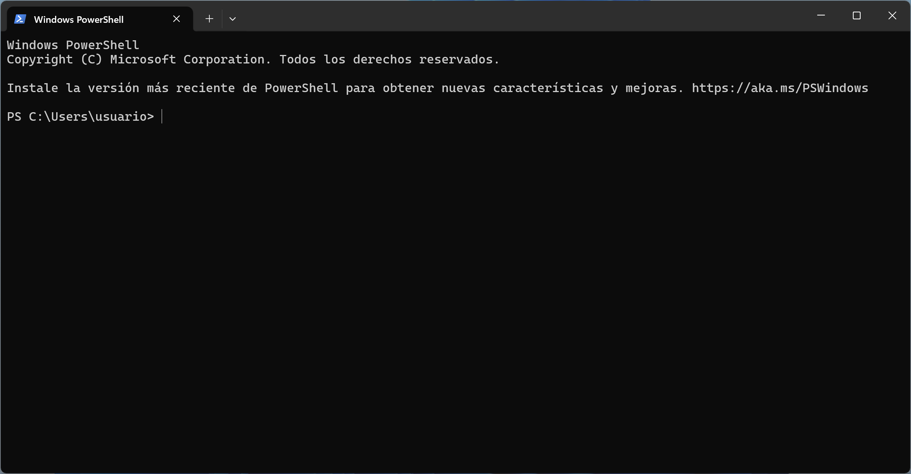

# make-scoop-windows

Instalación del comando `make` en Windows usando [Scoop](https://scoop.sh).

## Pasos a seguir

1. Abrir una ventana de PowerShell SIN privilegios de administrador.

   

2. Instalar [Scoop](https://scoop.sh):

    ```powershell
    Set-ExecutionPolicy -ExecutionPolicy RemoteSigned -Scope CurrentUser
    Invoke-RestMethod -Uri https://get.scoop.sh | Invoke-Expression
    ```

   

3. Instalar el comando `make`:

    ```powershell
    scoop install make
    ```

   
